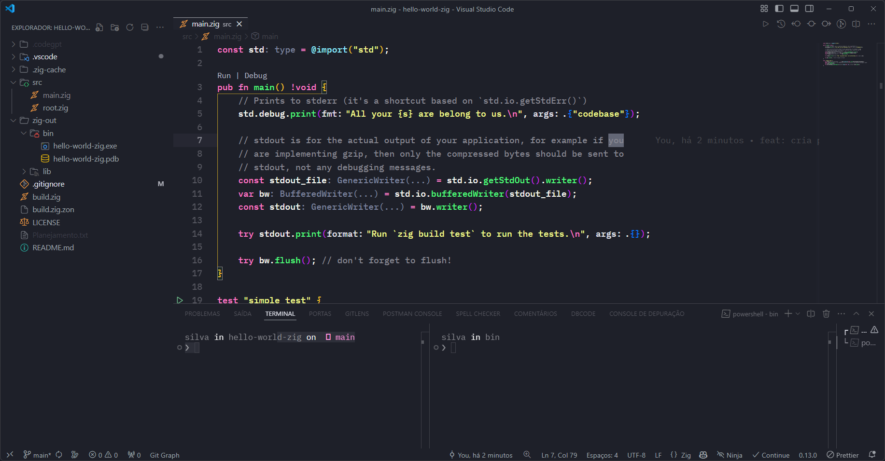

<h1 align="center">
    HELLO WORLD ZIG
</h1>

<h4 align="center">
    Criando um hello world na linguagem ZIG
</h4>

## Planejamento de estudo

```Plaintext
    Agenda:
    Data de Início: 07/01/2025

    1 - Primeiro modulo
    
    - Gerar o primeiro programa - Ola Mundo
    - Configurar build automatizado
    - Criar e visualizar primeira janela
```
## Imagens



## Descrição sobre a linguagem ZIG

Zig é uma linguagem de programação de baixo nível, projetada para ser simples, robusta e eficiente, com foco em sistemas embarcados e desenvolvimento de software próximo ao hardware. Ela foi criada como uma alternativa moderna ao C, oferecendo melhorias em segurança, desempenho e usabilidade, sem sacrificar o controle direto sobre os recursos do sistema.

### Principais características

- Sem coleta de lixo: Proporciona controle manual da memória.
- Segurança na memória: Detecta erros comuns, como uso de memória não inicializada e estouros de buffer, durante a compilação ou execução.
- Compilador de autocontenção: Inclui suporte embutido para compilar código C e C++, facilitando a interoperabilidade.
- Gerenciamento de erros explícito: Evita o uso de exceções e promove o tratamento direto de erros.
- Cross-compilation facilitada: O compilador Zig foi projetado para criar binários para diferentes plataformas de forma simples.

### Onde a linguagem Zig pode ser utilizada

- Desenvolvimento de sistemas operacionais: Devido ao controle próximo ao hardware.
- Sistemas embarcados: Zig é eficiente e utiliza poucos recursos.
- Desenvolvimento de jogos: Oferece baixo overhead e alta performance.
- Ferramentas e bibliotecas de baixo nível: Como drivers, compiladores ou programas utilitários.
- Interoperabilidade com C: Zig pode ser usado para substituir ou complementar código legado escrito em C ou C++.
- Aplicativos de alto desempenho: Projetos que exigem controle máximo sobre desempenho e uso de memória.

Zig é particularmente atrativa para desenvolvedores que precisam de controle detalhado do sistema e querem evitar as armadilhas comuns do C, enquanto aproveitam recursos modernos para maior segurança e produtividade.

## Executar o projeto

```bash
    # iniciar um projeto
    zig init

    # build do projeto
    zig build run

    # na pasta
    cd zig-out/bin

    # executar o aplicativo
    ./nome_do_seu_projeto.exe
```

## Licença

Este projeto é licenciado sob [CC0 1.0 Universal]. Consulte o arquivo [LICENSE](https://github.com/SilvaneiMartins/curso-zig/blob/master/LICENSE) para obter detalhes.

## Doações

Se você achar este projeto útil e quiser apoiar seu desenvolvimento contínuo, você pode fazer uma doação via `PIX` para e-mail `silvaneimartins@hotmail.com`.

Muito ❤️ pelo apoio!

## Contato

<a href="https://github.com/SilvaneiMartins">
    
    <br />
    <sub>
        <b>Silvanei de Almeida Martins</b>
    </sub>
</a>
     <a href="https://github.com/SilvaneiMartins" title="Silvanei martins" >
 </a>
<br />
🚀 Feito com ❤️ por Silvanei Martins